 
```{=html}
<nav class='year-switcher'>
  <a href='../2025/2025year.html' class='year-pill'>2025</a>
  <a href='../2026/2026year.html' class='year-pill active'>2026</a>
</nav>

<section class='timeline'>

  <article>
    <span class='timeline__month'>January</span>

    <div class='timeline__event'>
      <h3>Bball with Bennett & John</h3>
      <p></p>
      <div class='timeline__gallery'>
        <a href='pics/january/IMG_4548.jpeg' data-fancybox='january' data-caption='Pickup basketball with Bennett and John'>
          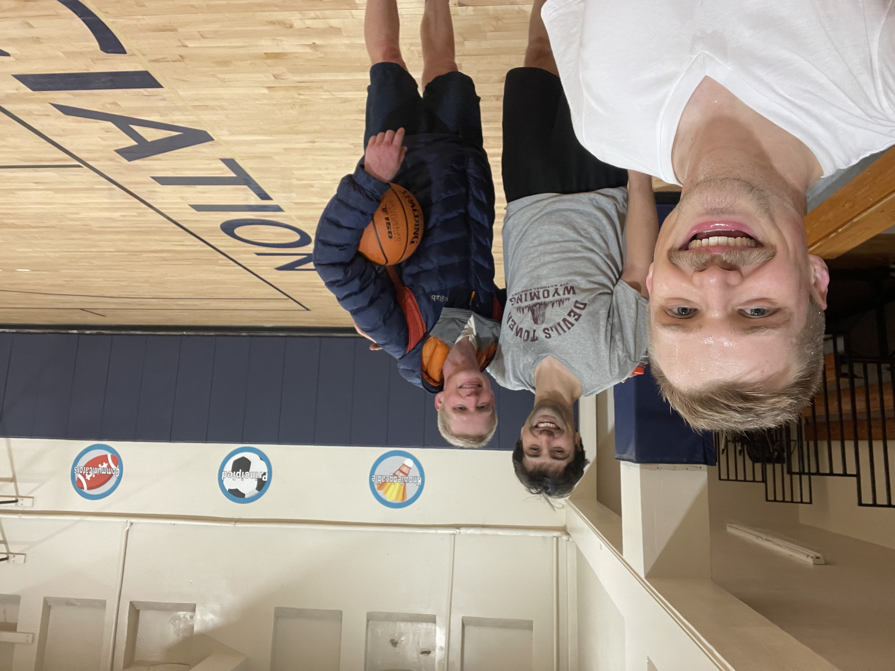
        </a>
      </div>
      
    </div>

    <div class='timeline__event'>
      <h3>Field Site — Elk Park</h3>
      <p>Jackson drove ~1.5 hours from Bozeman to check on one of his research exclosures (a fence to keep cows out). A windy winter had taken its toll: a big tree had come down and crushed part of the fence. Jackson broke out the chainsaw to clear the tree.</p>
      <div class='timeline__gallery'>
        <a href='pics/january/chainsaw/20260106-3543239778465714381 - Elk Park Jan0626.jpg' data-fancybox='january' data-caption='Elk Park exclosure'>
          
        </a>
        <a href='pics/january/chainsaw/20260106-6329075370832027016 - Elk Park Jan0626.jpg' data-fancybox='january' data-caption='Tree down on the fence'>
          
        </a>
        <a href='pics/january/chainsaw/20260106-DJI_20260106105401_0003_D - Elk Park Jan0626.jpg' data-fancybox='january' data-caption='Drone view of Elk Park'>
          
        </a>
        <a href='pics/january/chainsaw/20260106-DJI_20260106114536_0007_D - Elk Park Jan0626.jpg' data-fancybox='january' data-caption='Chainsaw work'>
          
        </a>
      </div>
    </div>

    <div class='timeline__event'>
      <h3>Burrito League</h3>
      <p>Grace won a lot of burritos for running a lot. She ran 125 miles in two weeks!  
        More information about the burrito league here: <a href='https://www.burrito-league.com/'>https://www.burrito-league.com/</a>
      </p>
      
    </div>
  </article>

  <article>
    <span class='timeline__month'>February</span>

    <div class='timeline__event'>
      <h3>Blake, Bennett, Hannah Visit Bozeman</h3>
      <p>Ski trip to Bridger and Big Sky.</p>
    </div>

    <div class='timeline__event'>
      <h3>Grace Habitat for Humanity</h3>
      <p>Went to Chico, CA with her coworkers to help build a house for wildfire affected families.</p>
    </div>
  </article>

  <article>
    <span class='timeline__month'>March</span>

    <div class='timeline__event'>
      <h3>Jackson XC Skiing</h3>
      <p>Finally got to use his new skis. Bad snow year. Bad conditions too!</p>
      <div class='timeline__gallery'>
        <a href='pics/march/badskiing.jpeg' data-fancybox='march' data-caption='Bad snow year, bad conditions'>
          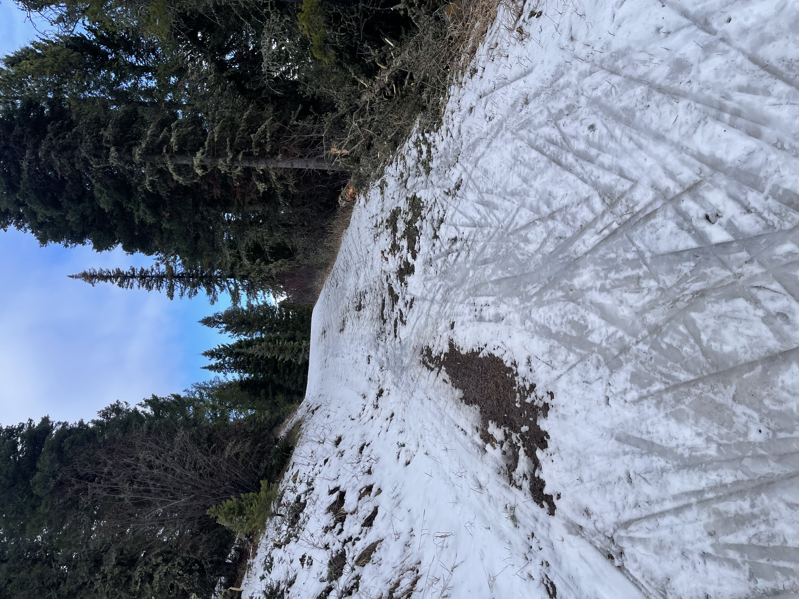
        </a>
      </div>
    </div>

    <div class='timeline__event' style='background: rgba(88, 140, 70, 0.12); border-color: rgba(88, 140, 70, 0.35);'>
      <h3>Jackson Lab & Greenhouse Work</h3>
      <p>Much of Jackson's time this spring was spent in MSU's greenhouse doing experiments. The basic idea: what happens to a toadflax plant when a weevil moves in?  
      
      To find out, I placed small stem-boring weevils directly onto potted toadflax plants and then waited. Over the following weeks, the weevils fed, mated, and laid eggs inside the plant's stems, while I periodically measured how the plants responded.

      After several weeks, I carefully dissected each stem to count the weevils inside and assess how far they had developed. Pairing those insect counts with the earlier stress measurements lets me ask interesting questions: what does the plant's stress response tell us about the weevil effectiveness as biological control agents?
The short answer is: we're finding out.</p>
      <div class='timeline__gallery'>
        <a href='pics/march/greenhouse/IMG_2010.jpg' data-fancybox='march' data-caption='Greenhouse work'>
          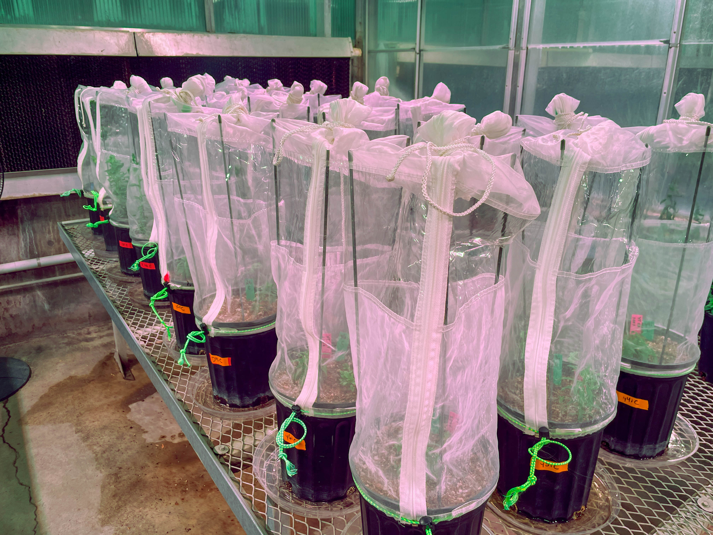
        </a>
        <a href='pics/march/greenhouse/IMG_2187.jpg' data-fancybox='march' data-caption='Greenhouse work'>
          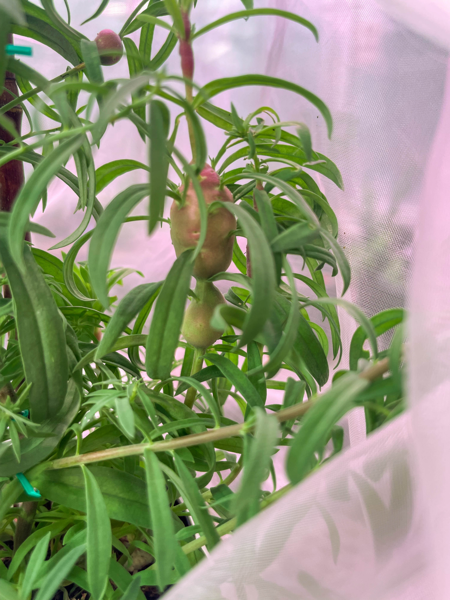
        </a>
        <a href='pics/march/greenhouse/20260320-P3203934.jpg' data-fancybox='march' data-caption='Greenhouse work'>
          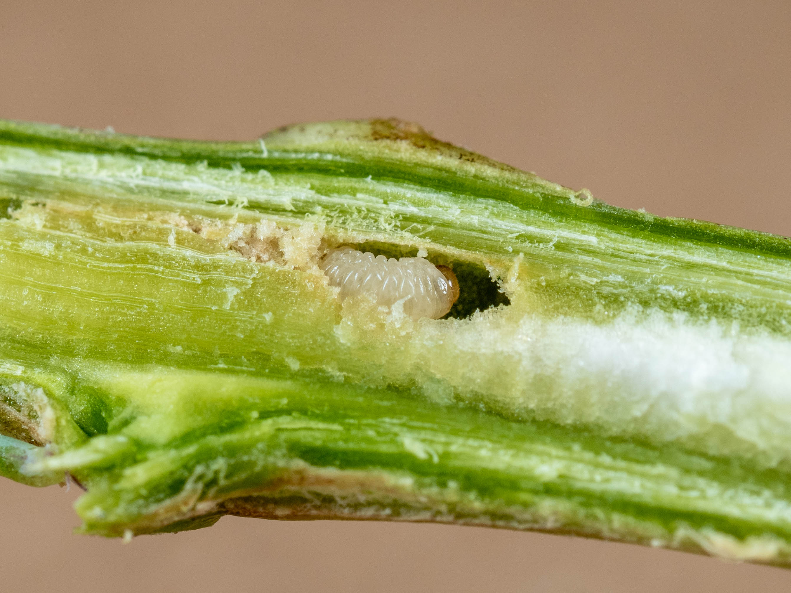
        </a>
        <a href='pics/march/greenhouse/20260320-P3203940.jpg' data-fancybox='march' data-caption='Greenhouse work'>
          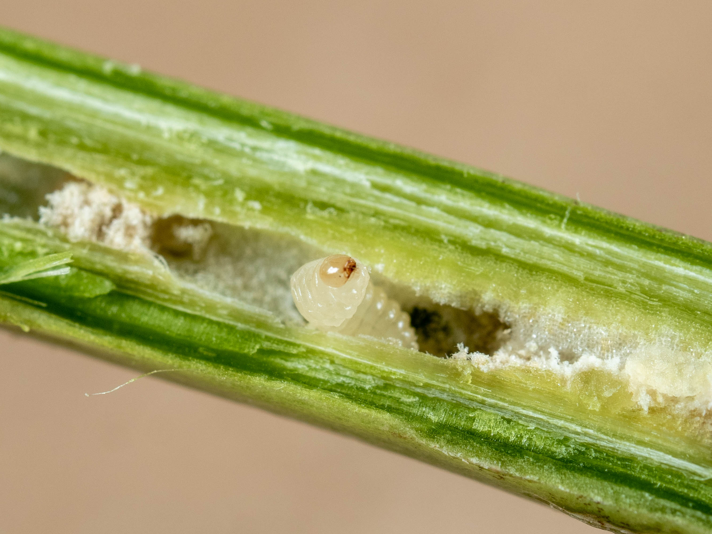
        </a>
        <a href='pics/march/greenhouse/20260320-P3203950.jpg' data-fancybox='march' data-caption='Greenhouse work'>
          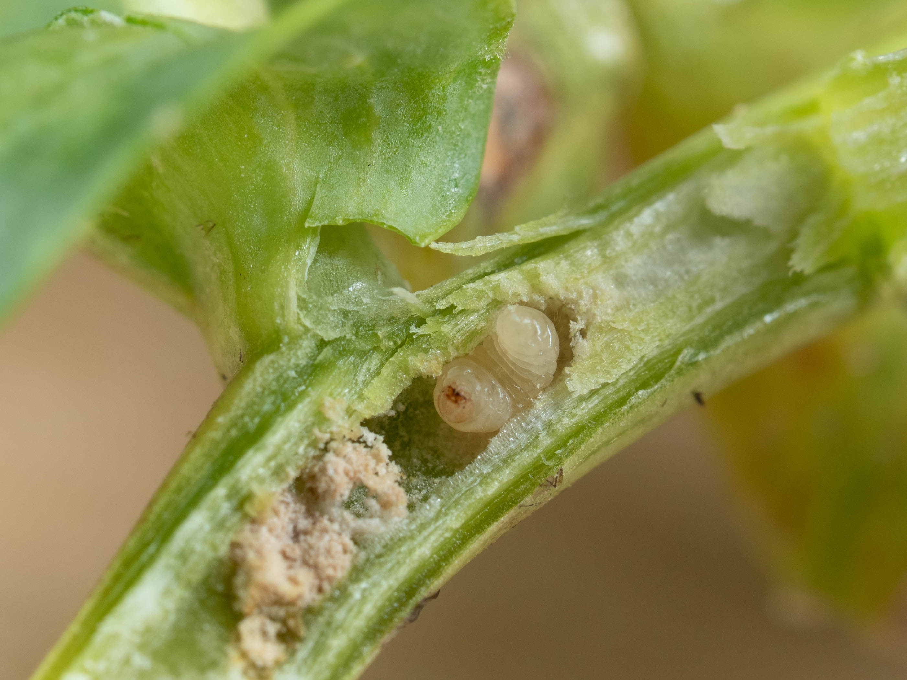
        </a>
      </div>
    </div>
  </article>

  <article>
    <span class='timeline__month'>April</span>

    <div class='timeline__event'>
      <h3>Hyalite Road!</h3>
      <p>Every spring the road up to Hyalite reservoir closes to vehicles, so it's a great time to run or bike. Grace fatbiked and I took some pictures with my drone and camera of her.</p>
      <div class='timeline__gallery'>
        <a href='pics/april/hyalite/20260404-DJI_20260404092302_0002_D.jpg' data-fancybox='april' data-caption='Hyalite Road'>
          
        </a>
        <a href='pics/april/hyalite/20260404-DJI_20260404092543_0009_D.jpg' data-fancybox='april' data-caption='Hyalite Road'>
          
        </a>
        <a href='pics/april/hyalite/20260404-P4043965.jpg' data-fancybox='april' data-caption='Hyalite Road'>
          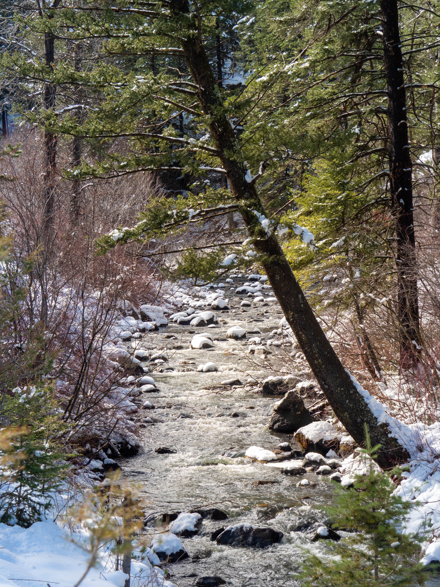
        </a>
        <a href='pics/april/hyalite/20260404-P4043977.jpg' data-fancybox='april' data-caption='Hyalite Road'>
          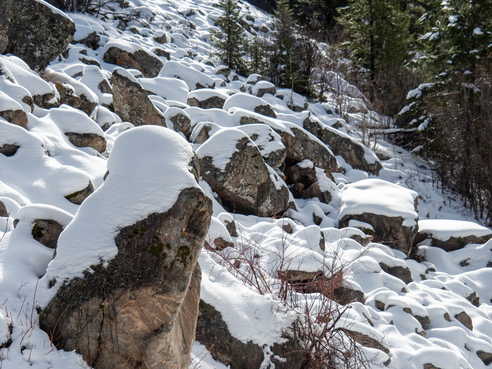
        </a>
        <a href='pics/april/hyalite/20260404-P4043983.jpg' data-fancybox='april' data-caption='Hyalite Road'>
          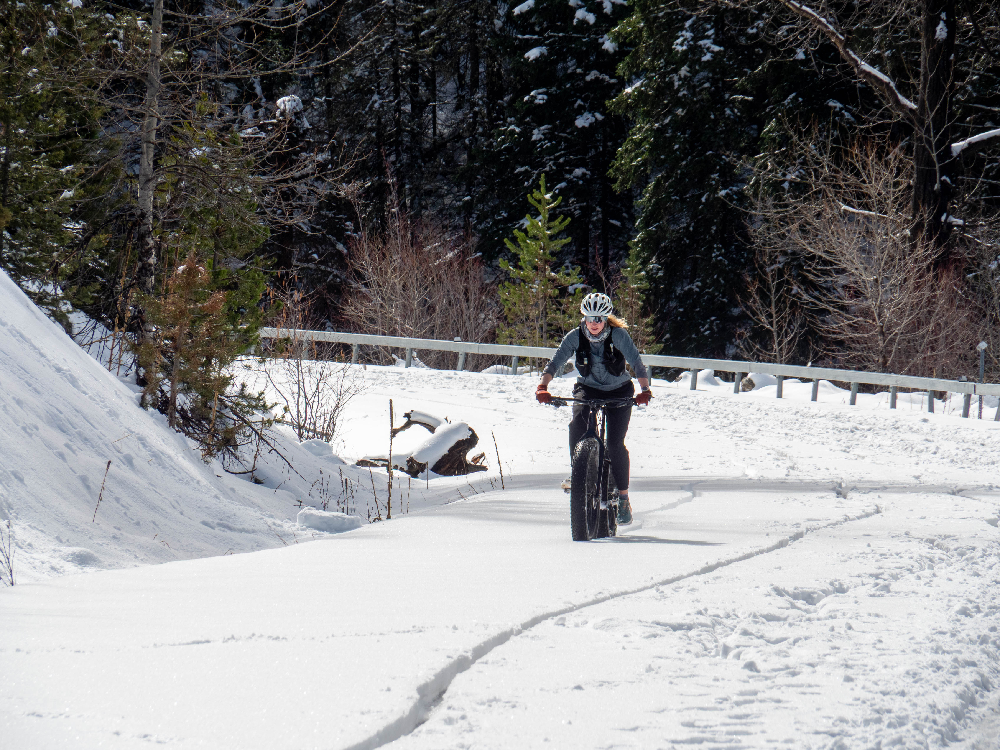
        </a>
        <a href='pics/april/hyalite/20260404-P4043991.jpg' data-fancybox='april' data-caption='Hyalite Road'>
          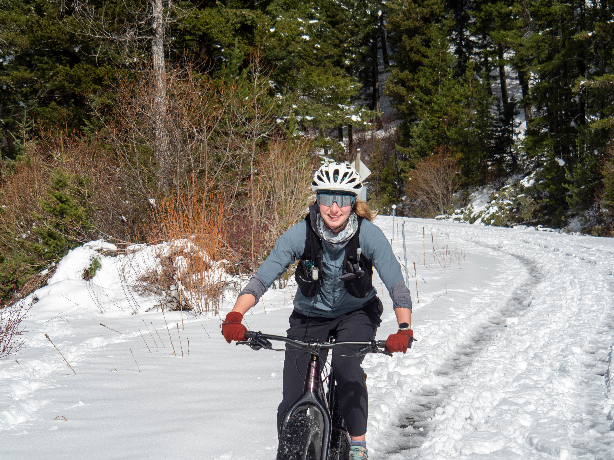
        </a>
      </div>
    </div>

    <div class='timeline__event'>
      <h3>Grace Work Trips</h3>
      <p>Went to Tampa, FL and MN for work related activities.</p>
    </div>

  <div class='timeline__event'>
      <h3>RACE: Expedition 12k</h3>
      <p>J&G both raced the Expedition 12k at Lewis and Clark Caverns State Park.</p>
    </div>
  
   </article>

   <article>
    <span class='timeline__month'>May</span>

   <div class='timeline__event'>
      <h3>Glacier NP Trip</h3>
      <p>Camping trip up in Glacier.</p>
    </div> 

    <div class='timeline__event'>
      <h3>Wedding in Greenville, SC</h3>
      <p>Sightseeing in Asheville, NC</p>
    </div> 


   </article>

  <article>
    <span class='timeline__month'>June</span>

    <div class='timeline__event'>
      <h3>Scout Mountain Runs — Pocatello, ID</h3>
      <p>J&G drove down to Pocatello to volunteer at the Scout Mountain Runs, a trail running event in the Caribou-Targhee National Forest.</p>
    </div>

  </article>

</section>
```
