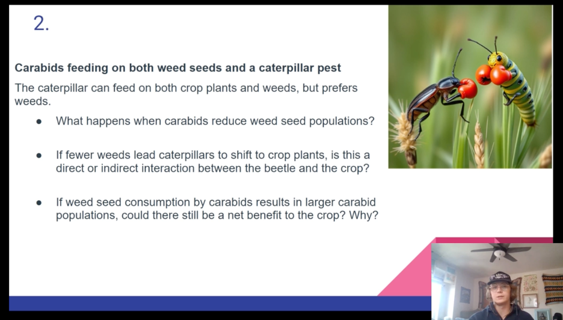
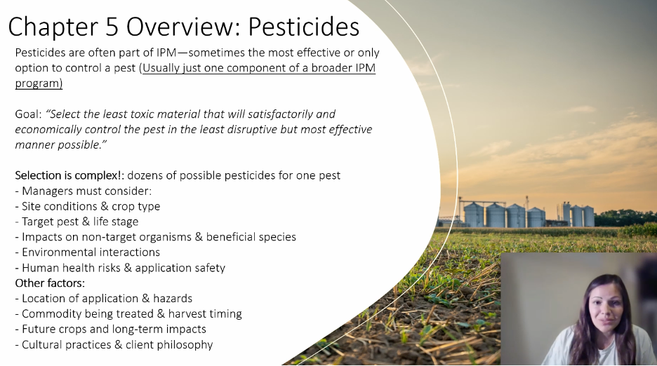
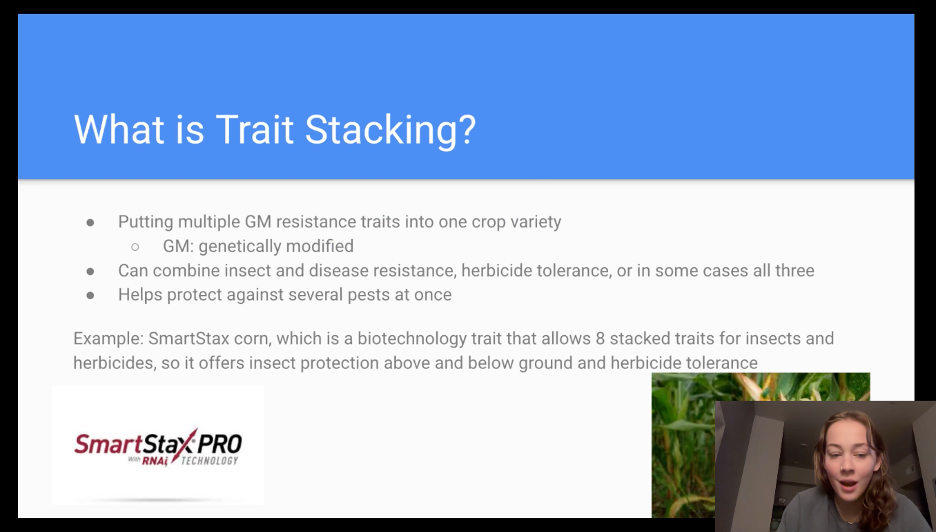

My approach to teaching is grounded in the belief that learning is a collaborative and inclusive process. A productive classroom is one in which all students feel welcome, respected, and empowered to contribute. I aim to create an environment that values curiosity, open dialogue, and intellectual risk taking, while maintaining clear expectations and academic rigor.

## An Inclusive Learning Environment

All students are welcome in my classroom. Students arrive with diverse backgrounds, experiences, and ways of thinking, and these differences strengthen the learning experience for everyone. I strive to create a space where students feel comfortable asking questions, expressing uncertainty, and engaging with challenging material. Respectful discourse and mutual support are foundational to effective learning and scientific inquiry.

## Active Participation and Engagement

Learning is not limited to mastering course content. It also involves understanding the perspectives of fellow classmates and applying knowledge to real world problems. I encourage active participation through discussion, collaborative activities, and problem solving exercises that require students to engage with both the material and one another. By hearing how peers approach the same question from different backgrounds and experiences, students gain a deeper and more nuanced understanding of the subject.

Active engagement helps students move beyond memorization toward synthesis and application. Through discussion, group work, and presentations, students practice translating theoretical concepts into practical insights, mirroring how scientific and professional challenges are addressed outside the classroom. This approach builds critical thinking skills, strengthens communication, and prepares students to work effectively in interdisciplinary and collaborative environments.

:::{.box}  

**Student led course discussion presentations from AGSC401: Integrated Pest Management - Fall 2025 at Montana State University.**  
Due to the increasing use of artificial intelligence and the asynchronous online format of the course, I altered the format to require the rotating weekly leader of each student group to create a brief, five-minute recorded presentation. These presentations tasked students with teaching their group-mates key concepts from the week’s material and were designed to promote discussion, and peer-to-peer learning.

:::{.columns}

::: {.column width="33%" .px-2}
{data-fancybox="gallery" data-caption=""}
:::

::: {.column width="33%" .px-2}
{data-fancybox="gallery" data-caption=""}
:::

::: {.column width="33%" .px-2}
{data-fancybox="gallery" data-caption=""}
:::

:::
:::

## Teaching and Learning in the Age of Artificial Intelligence

As artificial intelligence becomes increasingly integrated into education and research, it is essential to reaffirm the value of human interaction in the learning process. While AI tools can support learning, analysis, and efficiency, they cannot replace the intellectual growth that comes from discussion, debate, and face to face scientific communication. I place particular emphasis on in person interaction, presentations, and the clear communication of ideas, as these skills are critical for scientific collaboration, professional development, and responsible use of emerging technologies.

Ultimately, my goal is to prepare students not only to master course content, but to think critically, communicate effectively, and engage thoughtfully with others in an evolving academic and technological landscape.